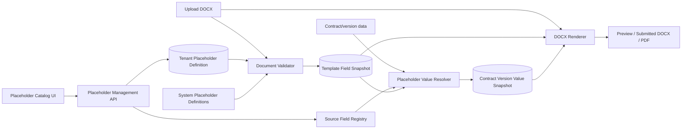

# Kế hoạch triển khai module Customize Contract Placeholder

## 1. Mục tiêu

Cho phép người có quyền `template.manage` tự tạo placeholder dùng trong DOCX và ánh xạ placeholder đó tới một trường dữ liệu thuộc các module đã được hệ thống công bố, ví dụ:

- `{{CUSTOMER_CONTACT_EMAIL}}` → `Customer.CustomerEmail`
- `{{CONTRACT_OWNER_NAME}}` → `Employee.EmployeeFullName`
- `{{PROVIDER_WEBSITE}}` → `TenantLegalProfile.Website`

Sau khi module hoàn thành, việc tạo thêm placeholder từ các nguồn dữ liệu đã hỗ trợ không cần sửa backend hoặc redeploy. Backend chỉ cần thay đổi khi muốn công bố một module/kiểu dữ liệu hoàn toàn mới hoặc thêm renderer cho một khối dữ liệu phức tạp.

## 2. Hiện trạng

Luồng hiện tại dùng `SoftwareSupplyPlaceholderCatalog` là policy tĩnh trong code:

1. `contract-template-placeholder-catalog.tsx` gọi `GET /api/contract-templates/placeholder-catalog` và chỉ hiển thị catalog.
2. `ContractTemplateDocumentValidator` dùng catalog tĩnh để nhận diện token, kiểm tra placeholder lạ, bắt buộc và số lần xuất hiện.
3. `ContractTemplateService.ReplaceFieldSnapshotAsync` sao chép các placeholder có trong DOCX vào `tbl_ContractTemplateField`.
4. `ContractTemplatePreviewRenderer` lấy danh sách scalar/dynamic placeholder từ catalog tĩnh và thay thế token.
5. `ContractDocumentPreviewService.CreateRenderData` dựng một dictionary với key được viết cứng như `CONTRACT_CODE`, `CUSTOMER_EMAIL`, ...
6. Hash preview chứa `SoftwareSupplyPlaceholderCatalog.Version`; catalog đổi là phải sửa code và tạo preview lại.

`tbl_ContractTemplateField` đã có phần lớn dữ liệu cần cho snapshot theo version (`PlaceholderKey`, `FieldLabel`, `DataSource`, `DefaultValue`, `FormatString`, `IsRequired`, `DisplayOrder`, `RowVersion`). Tuy nhiên renderer hiện chưa dùng bảng này làm nguồn mapping.

## 3. Phạm vi MVP

MVP hỗ trợ placeholder dạng giá trị đơn (`Scalar`) từ các module có quan hệ một-một rõ ràng với hợp đồng:

- Contract
- Contract version
- Customer
- Tenant legal profile
- Employee sở hữu/phụ trách hợp đồng
- Department của employee phụ trách, nếu quan hệ hiện tại cung cấp được

Placeholder tùy biến trong MVP:

- thuộc tenant hiện tại;
- dùng lại được cho nhiều template;
- luôn là tùy chọn và xuất hiện tối đa một lần trong một DOCX;
- chỉ ánh xạ tới source field nằm trong allowlist;
- có thể cấu hình giá trị mặc định và format phù hợp với kiểu dữ liệu;
- có thể ngừng sử dụng nhưng không xóa vật lý khi đã được tham chiếu.

Các dynamic block hiện hữu (`CONTRACT_ITEM_TABLE`, `PAYMENT_SCHEDULE_TABLE`, `CONTRACT_TERMS`, `SIGNATURE_PROVIDER`, `SIGNATURE_CUSTOMER`) tiếp tục là placeholder hệ thống. Việc cho người dùng tự xây bảng, collection, công thức hoặc biểu thức nối nhiều trường nằm ngoài MVP.

## 4. Nguyên tắc thiết kế

### 4.1. Không cho client gửi tên bảng/cột tùy ý

UI chỉ gửi một `sourceFieldKey` ổn định do backend công bố, ví dụ `customer.email`. Backend không chạy SQL động, không nhận expression, không dùng reflection trực tiếp trên chuỗi do người dùng nhập.

Mỗi source field có metadata:

- module key và tên module;
- field key và tên hiển thị;
- kiểu giá trị (`Text`, `Number`, `Date`, `DateTime`, `Boolean`);
- nullable hay không;
- các format được phép;
- giá trị mẫu dùng khi preview template;
- resolver dùng khi render hợp đồng thật.

### 4.2. Catalog tùy biến và template version là hai lớp khác nhau

- Catalog tùy biến là cấu hình sống của tenant, dùng để tạo placeholder mới và làm nguồn cho các template draft tiếp theo.
- `tbl_ContractTemplateField` là snapshot mapping của một template version tại thời điểm DOCX được upload/revalidate.
- Template version đã publish chỉ render bằng snapshot của chính version đó, không đọc mapping mới nhất từ catalog.

Nhờ vậy, sửa source hoặc format của placeholder không âm thầm thay đổi nội dung pháp lý của version đã publish.

### 4.3. Source field là allowlist có resolver

Tạo abstraction `IContractPlaceholderSourceRegistry` và các provider theo module. Một provider chịu trách nhiệm:

- công bố field được phép chọn;
- preload dữ liệu cần thiết theo batch;
- resolve giá trị từ render context;
- format và trả lỗi có mã rõ ràng.

Thêm placeholder mới chỉ ghi DB. Khi cần hỗ trợ module mới, lập trình viên thêm provider một lần thay vì thêm từng placeholder vào validator và renderer.

### 4.4. Giữ tính xác định của tài liệu pháp lý

Giá trị scalar tùy biến cần được snapshot theo contract version trước khi tạo artifact gửi duyệt/ký. Không đọc lại dữ liệu master hiện tại khi render lại một version lịch sử, vì Customer/Employee/Tenant profile có thể đã thay đổi.

## 5. Kiến trúc mục tiêu



## 6. Data model

### 6.1. Bảng mới `tbl_ContractPlaceholderDefinition`

Đây là catalog tùy biến của tenant database.

| Cột | Kiểu gợi ý | Ý nghĩa |
|---|---|---|
| `PlaceholderDefinitionId` | int identity | Khóa chính |
| `PlaceholderKey` | varchar(100) | Key chuẩn hóa uppercase, không có `{{ }}` |
| `FieldLabel` | nvarchar(300) | Tên hiển thị |
| `SourceFieldKey` | varchar(200) | Key ổn định từ source registry, không phải tên cột DB |
| `DefaultValue` | nvarchar(2000), null | Dùng khi nguồn trả null/rỗng |
| `FormatString` | varchar(100), null | Một format nằm trong danh sách cho phép của source field |
| `IsActive` | bit | Có còn được chọn cho template mới không |
| `CreatedEmployeeId` | int | Audit actor |
| `CreatedDate` | datetime2 | UTC |
| `UpdatedEmployeeId` | int, null | Audit actor |
| `UpdatedDate` | datetime2, null | UTC |
| `RowVersion` | rowversion | Optimistic concurrency |

Ràng buộc:

- unique index trên `PlaceholderKey` trong tenant DB;
- regex nghiệp vụ: `^[A-Z][A-Z0-9]*(?:_[A-Z0-9]+)*$`;
- không cho dùng key thuộc catalog hệ thống;
- không cho key dài hơn 100 ký tự;
- `SourceFieldKey` phải tồn tại và đang được registry hỗ trợ;
- `FormatString` phải hợp lệ với kiểu dữ liệu;
- không hard delete definition đã từng xuất hiện trong template version.

Không lưu `DataKind`, `Multiplicity`, `IsRequired` cho custom definition trong MVP vì custom placeholder luôn là `Scalar`, `ZeroOrOne`, không bắt buộc. Điều này tránh việc một placeholder tenant-wide mới làm toàn bộ template cũ bị invalid.

### 6.2. Mở rộng `tbl_ContractTemplateField`

Giữ bảng này làm snapshot bất biến theo template version và bổ sung:

| Cột | Kiểu gợi ý | Ý nghĩa |
|---|---|---|
| `SourceFieldKey` | varchar(200), null | Source registry key đã snapshot |
| `DataKind` | tinyint | Scalar hoặc DynamicBlock |
| `Multiplicity` | tinyint | ExactlyOne hoặc ZeroOrOne |
| `IsSystem` | bit | Phân biệt placeholder hệ thống và tùy biến |
| `DefinitionRowVersion` | varbinary(8), null | Trace definition đã dùng khi snapshot |

Giữ `DataSource` trong giai đoạn chuyển đổi để tương thích dữ liệu cũ; giá trị mới có thể chứa display path do registry cung cấp. Sau khi toàn bộ code chuyển sang `SourceFieldKey`, đánh giá deprecate `DataSource` ở migration sau.

### 6.3. Bảng mới `tbl_ContractVersionPlaceholderValue`

Lưu giá trị scalar đã resolve theo contract version:

| Cột | Kiểu gợi ý | Ý nghĩa |
|---|---|---|
| `ContractVersionPlaceholderValueId` | bigint identity | Khóa chính |
| `ContractId` | int | Phạm vi authorization và truy vấn |
| `VersionId` | int | Contract version sở hữu snapshot |
| `TemplateVersionId` | int | Template mapping đã dùng |
| `PlaceholderKey` | varchar(100) | Key đã snapshot |
| `SourceFieldKey` | varchar(200) | Nguồn đã dùng |
| `RawValue` | nvarchar(max), null | Giá trị chuẩn hóa trước format; cân nhắc JSON cho type |
| `RenderedValue` | nvarchar(max) | Giá trị cuối cùng chèn vào DOCX |
| `CapturedDate` | datetime2 | UTC |

Unique index: `(VersionId, PlaceholderKey)`.

Không ghi dữ liệu nhạy cảm không cần thiết vào snapshot. Source registry phải loại trừ password hash, token, OTP, secret, internal audit payload và file storage path.

## 7. Backend components

### 7.1. Source field registry

Tạo các kiểu chính:

```csharp
public enum PlaceholderValueType
{
    Text = 1,
    Number = 2,
    Date = 3,
    DateTime = 4,
    Boolean = 5
}

public sealed record ContractPlaceholderSourceField(
    string SourceFieldKey,
    string ModuleKey,
    string ModuleLabel,
    string FieldLabel,
    PlaceholderValueType ValueType,
    bool IsNullable,
    IReadOnlyList<string> AllowedFormats,
    string SampleValue);
```

Interfaces đề xuất:

```csharp
public interface IContractPlaceholderSourceProvider
{
    string ModuleKey { get; }
    IReadOnlyList<ContractPlaceholderSourceField> GetFields();
    Task<IReadOnlyDictionary<string, object?>> ResolveAsync(
        ContractPlaceholderResolveContext context,
        IReadOnlySet<string> sourceFieldKeys,
        CancellationToken cancellationToken);
}

public interface IContractPlaceholderSourceRegistry
{
    IReadOnlyList<ContractPlaceholderSourceField> GetAllFields();
    ContractPlaceholderSourceField GetRequired(string sourceFieldKey);
    Task<IReadOnlyDictionary<string, object?>> ResolveAsync(...);
}
```

Provider MVP:

- `ContractPlaceholderSourceProvider`
- `ContractVersionPlaceholderSourceProvider`
- `CustomerPlaceholderSourceProvider`
- `TenantLegalProfilePlaceholderSourceProvider`
- `ContractOwnerPlaceholderSourceProvider`
- `DepartmentPlaceholderSourceProvider` nếu quan hệ owner → department đủ ổn định

Registry phải từ chối key trùng giữa providers khi khởi động. Provider resolve theo batch để tránh một query cho mỗi placeholder.

### 7.2. Catalog service

Tạo `IContractPlaceholderDefinitionService` để:

- trả catalog hợp nhất giữa system definition và custom definition;
- trả danh sách module/source fields;
- create/update/deactivate custom definition;
- kiểm tra quyền `template.manage` và current tenant;
- kiểm tra reserved key, source key, format, concurrency;
- ghi audit không chứa giá trị dữ liệu hợp đồng.

Catalog hệ thống có thể tiếp tục nằm trong code ở bước đầu, nhưng phải được truy cập qua một abstraction chung, ví dụ `IContractPlaceholderCatalog`. Validator và service không được gọi trực tiếp `SoftwareSupplyPlaceholderCatalog.GetAll()`.

### 7.3. Validator

Refactor `ContractTemplateDocumentValidator`:

- inject `IContractPlaceholderCatalog`;
- lấy catalog hợp nhất theo tenant;
- giữ nguyên kiểm tra OOXML, macro, syntax và token split qua Word runs;
- custom key lạ vẫn trả `UnknownPlaceholder`;
- system required vẫn được kiểm tra như hiện tại;
- custom placeholder áp dụng `ZeroOrOne`;
- validation result trả definition snapshot, hoặc service dùng các recognized keys để đọc definition trong cùng transaction/revision.

Nên bổ sung `CatalogRevision` vào validation result để phát hiện catalog bị thay đổi giữa lúc validate và persist.

### 7.4. Template field snapshot

Refactor `ContractTemplateService.ReplaceFieldSnapshotAsync`:

- không loop qua static catalog;
- dùng definitions đã được validator xác nhận;
- ghi đủ `SourceFieldKey`, data kind, multiplicity, default, format, system/custom và definition revision;
- giữ transaction hiện tại để document metadata, field snapshot và audit commit cùng nhau;
- re-upload/revalidate draft sẽ tạo lại snapshot;
- publish khóa snapshot; không có endpoint sửa trực tiếp field của version đã publish.

### 7.5. Resolve và snapshot giá trị

Tạo `IContractPlaceholderValueService`:

1. Đọc `tbl_ContractTemplateField` của đúng template version.
2. Chỉ resolve các scalar fields thực sự có trong DOCX.
3. Gom `SourceFieldKey` theo provider/module.
4. Preload dữ liệu bằng render context hiện có.
5. Resolve raw value.
6. Nếu null/rỗng, dùng `DefaultValue`; nếu vẫn rỗng và required thì trả lỗi nghiệp vụ.
7. Áp dụng formatter allowlist theo invariant rules đã định nghĩa.
8. Lưu snapshot theo contract version.
9. Trả dictionary `PlaceholderKey → RenderedValue` cho renderer.

Thời điểm capture lại snapshot:

- khi tạo contract version mới;
- khi cập nhật draft làm thay đổi source data nằm trong contract/version;
- ngay trước submission nếu snapshot thiếu hoặc không khớp template version;
- không tự refresh version lịch sử đã gửi duyệt/ký.

### 7.6. Renderer

Refactor `ContractTemplatePreviewRenderer` để không biết catalog tenant và không query DB:

- nhận `TemplateRenderPlan` gồm danh sách field snapshot, scalar values và system dynamic blocks;
- dynamic block tiếp tục dispatch bằng renderer key hệ thống;
- scalar replacement dùng dictionary đã resolve theo placeholder key;
- `EnsureNoCatalogTokensRemain` kiểm tra token thuộc render plan/version, đồng thời báo token syntax còn sót;
- không dùng `SoftwareSupplyPlaceholderCatalog.GetAll()` để tìm dynamic/scalar keys.

`ContractDocumentPreviewService.CreateRenderData` bỏ dictionary key viết cứng cho scalar custom. Logic lấy dữ liệu chuyển vào source providers. Các builder cho item table, terms, payments và signature tiếp tục giữ nguyên trong MVP.

### 7.7. Template preview và preview hash

Preview trong màn quản lý template phải dùng `SampleValue` từ source registry cho custom scalar. Card/dialog hiển thị rõ đây là dữ liệu mẫu.

Thay `SoftwareSupplyPlaceholderCatalog.Version` trong `CreatePreviewSourceHash` bằng một binding hash ổn định được tính từ field snapshot của version:

```text
SHA256(documentHash + sorted(fieldSnapshot) + sampleDatasetVersion
       + rendererFormatVersion + languageMode)
```

Trong `fieldSnapshot` phải có key, source key, default, format, data kind và multiplicity. Sửa custom definition live không làm preview của version cũ stale; chỉ rebind/reupload draft mới làm hash thay đổi.

## 8. API contract

Giữ endpoint đọc cũ trong giai đoạn tương thích, nhưng mở rộng response với `id`, `isSystem`, `isActive`, `sourceFieldKey`, `moduleKey`, `valueType`, `defaultValue`, `formatString`, `rowVersion`.

Endpoints đề xuất:

| Method | Route | Mục đích |
|---|---|---|
| GET | `/api/contract-templates/placeholder-catalog` | Catalog hợp nhất system + custom |
| GET | `/api/contract-templates/placeholder-source-fields` | Module và field được phép chọn |
| POST | `/api/contract-templates/placeholders` | Tạo custom placeholder |
| PUT | `/api/contract-templates/placeholders/{id}` | Sửa label/source/default/format với rowVersion |
| POST | `/api/contract-templates/placeholders/{id}/deactivate` | Ngừng dùng cho template mới |
| POST | `/api/contract-templates/placeholders/{id}/activate` | Kích hoạt lại nếu source còn hợp lệ |
| GET | `/api/contract-templates/placeholders/{id}/usage` | Xem draft/published versions đang tham chiếu |

Create request:

```json
{
  "placeholderKey": "CONTRACT_OWNER_NAME",
  "fieldLabel": "Người phụ trách hợp đồng",
  "sourceFieldKey": "contract-owner.full-name",
  "defaultValue": "",
  "formatString": null
}
```

Update request bắt buộc có `rowVersion`. Không cho sửa `placeholderKey` sau khi tạo; muốn key khác thì tạo definition mới và deactivate key cũ.

Error codes tối thiểu:

- `PlaceholderKeyInvalid`
- `PlaceholderKeyAlreadyExists`
- `SystemPlaceholderImmutable`
- `PlaceholderSourceUnsupported`
- `PlaceholderFormatInvalid`
- `PlaceholderDefinitionInactive`
- `PlaceholderDefinitionInUse`
- `PlaceholderConcurrencyConflict`
- `PlaceholderValueRequired`
- `PlaceholderValueResolveFailed`

## 9. Frontend

Refactor `Frontend/components/contract-templates/contract-template-placeholder-catalog.tsx` thành màn quản lý:

### 9.1. Header

- giữ search hiện tại;
- thêm nút `Tạo placeholder`;
- thêm filter `Tất cả / Hệ thống / Tùy chỉnh / Ngừng dùng`;
- mô tả rõ custom placeholder dùng được cho các template mới hoặc lần revalidate tiếp theo.

### 9.2. Card

Ngoài copy token, card hiển thị:

- badge `Hệ thống` hoặc `Tùy chỉnh`;
- module và field nguồn;
- kiểu dữ liệu;
- default/format nếu có;
- trạng thái active;
- nút sửa và ngừng dùng cho custom item;
- link/số lượng version đang dùng definition.

System item không có action sửa.

### 9.3. Dialog tạo/sửa

Form gồm:

1. Placeholder key: tự uppercase, bỏ `{{ }}` nếu người dùng paste token, validate trực tiếp.
2. Tên hiển thị.
3. Module: combobox có search.
4. Trường dữ liệu: combobox phụ thuộc module, hiển thị type và nullable.
5. Format: select theo `allowedFormats`, không cho nhập format tùy ý trong MVP.
6. Giá trị mặc định.
7. Preview: `{{KEY}} → giá trị mẫu đã format`.

Khi sửa, khóa field `Placeholder key`. Submit disabled khi form chưa đổi hoặc invalid. Xử lý row-version conflict bằng thông báo tải lại dữ liệu.

### 9.4. Service/types

Mở rộng `Frontend/services/contract-template-api.ts` với DTOs và methods tương ứng. Sau khi create/update/activate/deactivate thành công, refresh catalog và giữ keyword/filter hiện tại.

### 9.5. Phạm vi màn hình

Component hiện đang nằm trong trang một template version nhưng catalog thực tế là tenant-wide. MVP giữ vị trí hiện tại để ít thay đổi navigation; tiêu đề và mô tả phải nói rõ phạm vi tenant. Giai đoạn sau có thể chuyển thành route riêng `/admin/contract-placeholders` và để version page chỉ hiển thị shortcut/catalog picker.

## 10. Authorization, audit và bảo mật

- Tất cả endpoint quản lý dùng `RbacPermissions.TemplateManage` như controller hiện tại.
- Query luôn chạy trong application DbContext của tenant đã resolve.
- Không nhận tenant ID từ request body để chọn database.
- Source registry không công bố secret hoặc internal-only fields.
- Không thực thi SQL, C#, JavaScript, template expression hay reflection path do người dùng nhập.
- Chuẩn hóa và encode giá trị như text khi ghi vào OpenXML; dynamic OpenXML chỉ đến từ renderer hệ thống.
- Audit create/update/activate/deactivate gồm key, source key, format và actor; không audit resolved customer/employee values.
- Usage endpoint không được vượt qua authorization của template.

Action types bổ sung:

- `PlaceholderDefinitionCreated`
- `PlaceholderDefinitionUpdated`
- `PlaceholderDefinitionActivated`
- `PlaceholderDefinitionDeactivated`
- `TemplatePlaceholderSnapshotRebound`

## 11. Migration và tương thích dữ liệu

### Bước 1: schema additive

- tạo `tbl_ContractPlaceholderDefinition`;
- thêm cột nullable vào `tbl_ContractTemplateField`;
- tạo `tbl_ContractVersionPlaceholderValue`;
- chưa xóa hoặc đổi semantics cột cũ.

### Bước 2: backfill system fields

- map các `DataSource` hiện tại sang `SourceFieldKey` tương ứng;
- set `DataKind`, `Multiplicity`, `IsSystem = 1`;
- migration phải fail rõ ràng nếu gặp `DataSource` cũ không map được, không âm thầm gán source khác.

### Bước 3: dual read có thời hạn

- field mới có `SourceFieldKey` thì dùng registry;
- dữ liệu cũ chưa backfill chỉ được fallback qua adapter mapping tĩnh đã kiểm thử;
- log metric số lần fallback;
- bỏ fallback khi metric về 0 và dữ liệu đã được kiểm chứng.

### Bước 4: chuyển catalog/validator/renderer

- endpoint catalog trả merged definitions;
- upload snapshot definitions mới;
- preview và contract render dùng version snapshot;
- giữ nguyên key system và output hiện tại để tránh làm hỏng DOCX đang dùng.

### Bước 5: bật mutation UI

Đặt create/update/deactivate sau feature flag `CustomContractPlaceholders`. Bật cho tenant nội bộ trước, sau đó rollout dần.

## 12. Test plan

### 12.1. Unit tests

- normalize và validate placeholder key;
- reserved/system key không thể override;
- source registry phát hiện duplicate key;
- source field lookup và unsupported source;
- formatter theo Text/Number/Date/DateTime/Boolean;
- default value khi null;
- custom definition luôn Scalar + ZeroOrOne;
- system definition giữ required/multiplicity hiện tại;
- renderer thay token bị split qua nhiều Word runs;
- renderer không thay text gần giống token;
- dynamic block system vẫn giữ layout rule hiện tại.

### 12.2. Service/integration tests

- tenant A không đọc/sửa definition của tenant B;
- create/update/deactivate với `template.manage`;
- actor thiếu quyền bị từ chối;
- concurrency conflict không ghi đè;
- upload DOCX nhận custom active key;
- upload từ chối unknown/inactive key;
- reupload draft snapshot mapping mới;
- published version giữ mapping cũ sau khi catalog thay đổi;
- placeholder đang được published version dùng vẫn render sau khi definition deactivate;
- contract version snapshot không đổi khi customer/employee master data đổi;
- preview hash đổi khi field snapshot/default/format đổi;
- preview hash không đổi khi definition live đổi nhưng version chưa rebind;
- audit không chứa resolved PII value.

### 12.3. Regression tests bắt buộc

- toàn bộ `ContractTemplateDocumentValidatorTests`;
- `ContractTemplateDocumentUploadServiceTests`;
- `ContractTemplatePreviewTests`;
- `ContractDocumentPreviewServiceTests`;
- các test submission/signing dùng artifact đã render;
- kiểm tra DOCX và PDF của template hiện tại cho kết quả tương đương trước migration.

### 12.4. Frontend tests/QA

- search/filter merged catalog;
- create hợp lệ và duplicate key;
- đổi module reset field đang chọn;
- format options thay đổi theo type;
- edit conflict hiển thị đúng;
- system card không có edit/deactivate;
- copy token vẫn hoạt động;
- responsive dialog và keyboard navigation;
- empty/loading/error states;
- disabled/deactivated item được phân biệt rõ.

## 13. Observability

Metrics/logs đề xuất:

- số custom definitions active theo tenant;
- thời gian resolve theo provider;
- số field được resolve mỗi render;
- source resolve failures theo `SourceFieldKey` nhưng không log giá trị;
- số lần dùng default value;
- số lần legacy fallback;
- preview invalidated/rebound count.

Không đưa PII hoặc rendered value vào structured log.

## 14. Thứ tự triển khai

### Phase A — Foundation

1. Tạo source field DTOs, registry, formatter và providers MVP.
2. Tạo schema definition + template field extensions.
3. Seed/mapping system definitions qua adapter chung.
4. Viết unit tests registry/formatter.

Kết quả: backend có vocabulary nguồn dữ liệu ổn định nhưng hành vi hiện tại chưa đổi.

### Phase B — Catalog management

1. Tạo definition service, request/response DTOs và controller endpoints.
2. Thêm authorization, concurrency và audit.
3. Refactor GET catalog thành merged catalog.
4. Nâng cấp frontend catalog, dialog create/edit/deactivate.

Kết quả: người dùng cấu hình được placeholder custom nhưng feature flag chưa cho dùng trong DOCX production.

### Phase C — Validation và template snapshot

1. Inject catalog abstraction vào validator.
2. Refactor upload transaction để snapshot recognized definitions.
3. Backfill field snapshots cũ.
4. Bổ sung usage endpoint và UI cảnh báo phạm vi ảnh hưởng.

Kết quả: custom placeholder được upload/revalidate an toàn trong draft.

### Phase D — Resolve và render

1. Tạo value service và contract version value snapshot.
2. Refactor sample preview và real contract render.
3. Refactor renderer nhận render plan.
4. Đổi preview hash sang binding hash.
5. Chạy regression DOCX/PDF và artifact submission/signing.

Kết quả: custom scalar placeholder chạy xuyên suốt từ DOCX template tới hợp đồng thật.

### Phase E — Rollout

1. Bật feature flag cho tenant nội bộ.
2. Theo dõi resolve failure, legacy fallback và preview generation.
3. Chạy thử create → upload → preview → publish → contract → submit → sign.
4. Bật dần cho tenant khác.
5. Loại bỏ direct call tới static catalog và legacy fallback sau khi ổn định.

## 15. Acceptance criteria

Module được coi là hoàn thành khi:

1. Người có `template.manage` tạo được custom scalar placeholder từ UI.
2. Người dùng chỉ chọn source field từ module registry; không thể nhập DB path/expression tùy ý.
3. Không thể override hoặc sửa placeholder hệ thống.
4. DOCX chứa custom active placeholder upload và validate thành công.
5. DOCX chứa unknown/inactive placeholder bị báo lỗi cụ thể.
6. Preview template hiển thị sample value đúng format.
7. Contract preview/submission render giá trị thật đúng source và format.
8. Mapping của published template version không đổi khi catalog live bị sửa/deactivate.
9. Contract version lịch sử không đổi khi dữ liệu Customer/Employee/Tenant thay đổi.
10. Mọi mutation có audit và optimistic concurrency.
11. Không có SQL động, arbitrary reflection path hoặc secret field trong source catalog.
12. Các placeholder hệ thống và DOCX hiện hữu tiếp tục hoạt động tương đương trước migration.

## 16. Quyết định để dành cho phase sau

- Placeholder bắt buộc tùy theo từng template thay vì tenant-wide.
- Placeholder dạng collection/dynamic block do người dùng tự thiết kế.
- Công thức nối nhiều field, conditional, fallback chain hoặc computed expression.
- Lookup tới Product/Service cụ thể khi một hợp đồng có nhiều items.
- Versioning riêng cho custom definition và giao diện diff mapping.
- Import/export catalog giữa tenants.
- Route quản trị placeholder độc lập khỏi trang template version.

Các nhu cầu này nên được xây trên source registry và version snapshot của MVP, không mở rộng bằng cách cho người dùng nhập SQL/expression trực tiếp.
